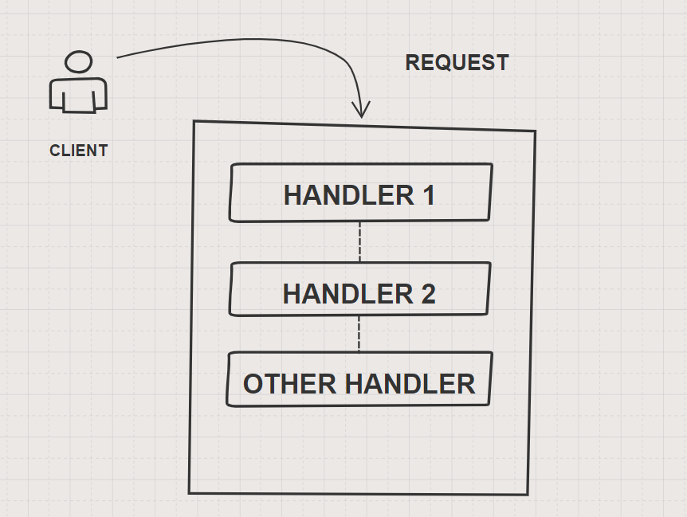

import { Head } from 'mdx-deck'
import {Appear, Notes} from 'mdx-deck'
import { CodeSurfer } from "mdx-deck-code-surfer"
import { Split } from 'mdx-deck/layouts'
// import oceanicNext from "prism-react-renderer/themes/oceanicNext"
import nightOwl from "prism-react-renderer/themes/nightOwl"
import './script.js'
import WhiteLayout from './components/white-layout'
import Layout from './components/layout.js';
import { FirstSlide } from './components/first-slide'

export { default as theme } from './theme'

<Head>
  <title>mdx-deck</title>
</Head>

export default WhiteLayout

<FirstSlide
  title="Express & Middleware"
  subtitle="L'incarnation de la Chaîne de Responsabilité"
/>


```notes
- Prez
- Audience 3 questions
- Partager mon aventure avec Express.js
```

---

# En route


---

# Express.js 


```notes
- Express.js => Node.js web application framework 
- Etendre, Augmenter Node.js => Layer on top Node.js HTTP server 
- Routing + Middleware Pattern 
```

---

# Bien avant le "Middleware Pattern"

```notes
- Pattern ?
- Design Pattern ?
- Même chose ? Réponse oui & non 
```

---

# Design Patterns
## Gang of Four ( GoF ) 
📖
<h3>Erich Gamma, Richard Helm, Ralph Johnson, John Vlissides</h3>

```notes
- Bouquin => 23 DP
- Middleware ne fait pas partie => Distinction ( avant et après) +
- Racine dans le monde Objet
- Comment transvaser ?
- Mais on les retrouve dans JS => Why ? Revenir à la déf d'un DP
```

---

## Solution face à un problème récurrent dans un contexte particulier

<h3>Recette de cuisine 📜</h3>

---

## Design Pattern

<Appear>
  <h2>Nom</h2>
  <h2>Problème</h2>
  <h2>Solution</h2>
  <h2>Conséquences</h2>
</Appear>

```notes
- Qu'importe le langage => Coeur du problème identique
- Solution impl diff
```
---

## Plus loin que la documentation officielle 🤔

<h3> Design Pattern du GoF : <div>Chain of Responsibility</div></h3>

---


<!-- ## L'expéditeur d'une requête n'a pas à connaitre ses destinataires -->
## Un expéditeur n'a pas besoin de connaître ses destinataires

---



```notes
- Transmettre la requête à un ensemble de services susceptibles de la traiter.
- L'ensemble des services forment une chaîne et la requête est transmise de service en service jusqu'à son traitement.
- Flexible, découplage, responsabilité, indépendant
- Ordre important (priorité), requête non traitée, performance 
```

---

## Et dans le monde Node.js ?

---

## Middleware dans Express

```notes
- Ensemble de services souvent sous la forme de fonctions
- Organisées en pipeline (chainage)
- Responsable traitement des requêtes HTTP et des réponses renvoyées
- Déf === CoR
- Ceux qui connaissent => middleware pas que ça
- Mixte de DP
```
---

<CodeSurfer
  code={require("raw-loader!./snippets/1.snippet")}
  title="Middleware signature"
  lang="javascript"
  theme={nightOwl}
/>


---
export default Layout

<CodeSurfer
  code={require("raw-loader!./snippets/2.snippet")}
  title="Démarrer Express"
  lang="javascript"
  theme={nightOwl}
  showNumbers={false}
/>

---

<CodeSurfer
  code={require("raw-loader!./snippets/3.snippet")}
  title="Des Middlewares"
  lang="javascript"
  theme={nightOwl}
  showNumbers
  steps= {[
    { range: [1, 6]},
    { lines: [1] },
    { tokens: { 1: [4, 6, 8] }},
    { lines: [2] },
    { lines: [3] },
    { range: [4, 5]},
    { range: [8, 12]},
    { range: [14, 16]},
  ]}
/>

---

<CodeSurfer
  code={require("raw-loader!./snippets/4.snippet")}
  title="Mise en place du pipeline"
  lang="javascript"
  theme={nightOwl}
  showNumbers
  steps= {[
    { lines: [1]},
    { tokens: { 1: [4] }},
    { tokens: { 1: [6] }},
    { lines: [3]},
    { tokens: { 3: [2] }},
    { tokens: { 3: [4, 6] }},
    { range: [5, 7]},
  ]}
/>

---

export default Layout

<CodeSurfer
  code={require("raw-loader!./snippets/5.snippet")}
  title="On raccroche le tout"
  lang="javascript"
  theme={nightOwl}
  showNumbers
  steps= {[
    { range: [6, 11]},
    { range: [13, 17]},
    { range: [19, 21]},
    { lines: [23]},
    { lines: [25]},
    { range: [27, 29]},
    { range: [1, 31]},
  ]}
/>

---

http://localhost:3000/

<!--
<div>Middleware 1</div>
<div>Middleware 2</div>
<div>Middleware 3</div>
<div>Middleware 2 AGAIN</div>
<div>Middleware 1 AGAIN</div>
-->

---

http://localhost:3000/hello

<!--
<div>Middleware 1</div>
<div>Middleware 2</div>
<div>Hello World</div>
<div>Middleware 2 AGAIN</div>
<div>Middleware 1 AGAIN</div>
-->

<!-- ---

# Middleware comme Pattern -->

---

## Derrière chaque nouveauté se cache des fondamentaux

<!-- ---

# Retenir en quelques points
 💡  -->

---

## Merci de votre écoute ! 
## Des questions ? 😁